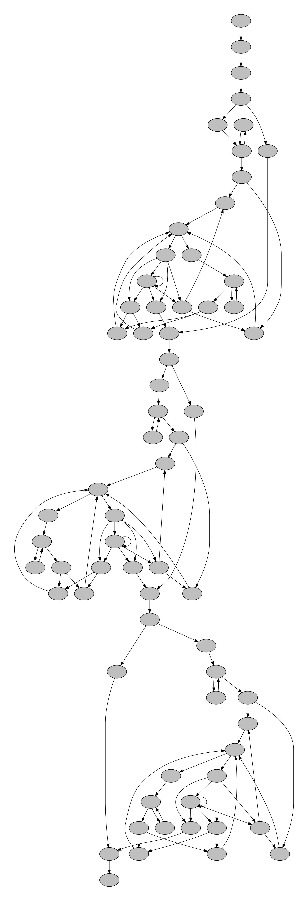

# h-CFA
A prototype implementation of [h-CFA](https://github.com/fiigii/Master-Thesis/blob/master/thesis.pdf). It uses a specific environment exetension function to propagate "program execution history" (encoded by environment).

## Building  

To compile the project run `sbt compile` which places the class files in the target directory.

The main class is org.ucombinator.cfa.RunCFA.

## Example  
```scheme
(define (fib n)
  (if (<= n 1)
      1
      (+ (fib (- n 1) (- n 2)))))

(define a (fib 2))
(define b (fib 10))
(define c (fib 5))
```
The control flows that are generated by h-CFA shows below:


There is no any call-return mismatch in this flow graph.
